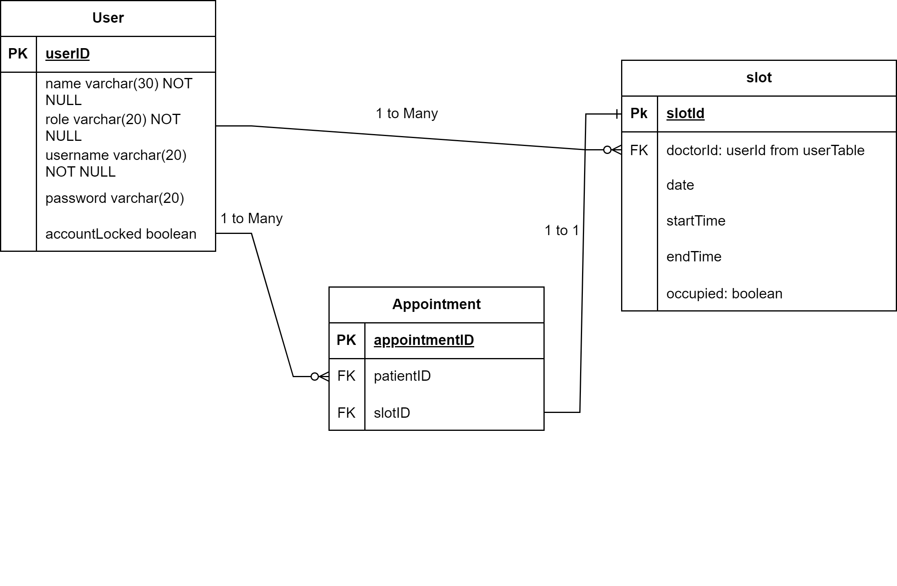

# CLI Health Care Management System

This is a command-line-based Health Care Management System implemented in Java. It provides functionality for managing health care records, appointments, and patient information.

## Usage Instructions

To run the CLI Health Care Management System, follow these steps:

1. Ensure you have Java installed on your system.

2. Clone or download this repository to your local machine.

3. Set up the required databases:
    - MySQL server with two databases: `HealthCareTest` (for database connection) and `HealthCareDatabase` (for Hibernate connection).

4. Update the database connection details in the configuration files:
   utilities.DatabaseConnection for Database
   context.ServiceContext.getSessionFactory()
   To match your local database setup.

5. Clone the repository and open it using IntelliJ
6. Install the Maven dependencies
7. Run the program using the main CLI class.

## Entity Relationship Diagram (ERD)

The following ERD illustrates the database structure for the Health Care Management System:

The ERD shows three tables: User, Slot, and Appointment.

## Functionalities

### Admin Functions

1. Add User
2. View All Users
3. View Patients
4. View Doctors
5. Lock User
6. Unlock User
7. View Scheduled Appointments
8. Delete User

### Doctor Functions

1. View Scheduled Slots
2. View Appointments
3. Add a New Slot entry
4. View Booked Slots
5. View Free Slots

### Patient Functions

1. View Available Doctor slots
2. View Appointments
3. Create an Appointment

These functionalities allow administrators, doctors, and patients to perform various operations within the Health Care Management System based on their respective roles.

Please note that the system currently supports the database and Hibernate storage options. The file storage option is still under development and not fully implemented.